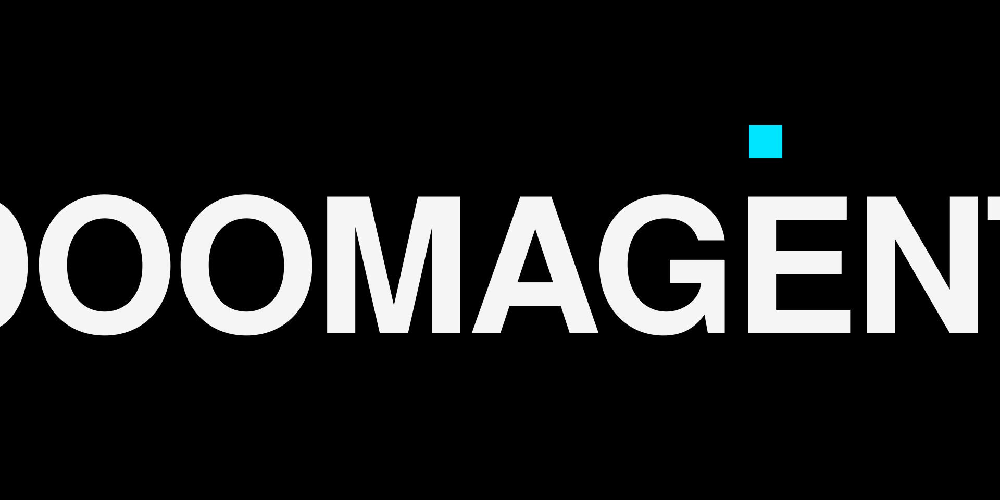

# DOOMAGENT



**The mind of a firm. The speed of one.**

20 free cognitive skills for AI agents + 1 master skill (paid). Built by ASLAM, useful not flashy.

Each skill is a small cognitive operating system — a structured way of thinking that any AI model can load and apply. Drop them into Claude Code, Cursor, Windsurf, OpenAI, or any agent framework. They make the model think more carefully about specific kinds of work.

**[→ Live site: doomagent.vercel.app](https://doomagent.vercel.app)** · Apache 2.0 for the free library.

## 🔥 OMNISCIENCE — The Master Skill

> **20 lenses. One cascade. Zero blind spots.**

OMNISCIENCE is the **only paid skill** in the library — and the only one you need to load. It contains all 20 free skills as named **lenses**, orchestrated by a 9-step reasoning cascade:

```
1. DECODE  → restate the true intent
2. FORK    → generate 3-5 distinct approaches
3. STRESS  → pre-mortem each candidate
4. COMMIT  → pick the risk-adjusted best
5. AUDIT   → run the relevant lenses
6. BUILD   → lead with conclusion
7. ATTACK  → red team the output
8. COMPRESS → one-sentence test
9. SHIP    → calibrated, terse, honest
```

Inside the **AUDIT** step, OMNISCIENCE picks the right lenses from the 20-skill library:

| Lens | What it audits |
|---|---|
| **NOUS** | Are we solving the right problem, or the assumed one? |
| **PHRONESIS** | What are we trading off, and what's the flip variable? |
| **METIS** | Are we fixing the symptom or the cause? |
| **ATLAS** | Will this still be a good decision in 5 years? |
| **THALASSA** | Will the schema survive 18 months of code churn? |
| **AETHER** | Is the API contract sacred? |
| **AEGIS** | Has this been threat-modeled? |
| **STASIS** | Are we recomputing what we shouldn't? |
| **KRATOS** | Is "fast" measured or assumed? |
| **ARGO** | Are agent roles clear, or will they collide? |
| **MNEMOSYNE** | Are decisions being preserved across the session? |
| **TECHNE** | Will the next tired person understand this? |
| **MORPHE** | Does the shape match the intent? |
| **STIGMA** | Have the corner cases been tested? |
| **ALETHEIA** | Is the documentation honest? |
| **CHRONOS** | Is this automated, or does it depend on memory? |
| **VIGIL** | Will we see it fail, or fail silently? |
| **LUMEN** | Is the visual hierarchy deliberate? |
| **IRIS** | Does the design system hold, or are we hard-coding? |
| **ETHOS** | Did the user opt in to this layer? |

Plus the **Expert Panel** (DOMAIN EXPERT · RED TEAM · SHIPPER) argues with itself inside the cascade. If all three agree instantly, OMNISCIENCE forces disagreement — shallow consensus is rejected.

**Output format:**
```
LINE 1: The answer, the conclusion, the bottom line.
LENSES: ✓ [passed] · ⚠ [flagged] · ✗ [failed]
CONFIDENCE: X% — [one-line reason]
FLIP VARIABLE: [what would change this answer]   ← for trade-off questions
```

### Why OMNISCIENCE is paid when the other 20 are free

The other 20 are **instruments**. OMNISCIENCE is the **conductor** — it knows when to use which instrument, in what order, and when two instruments contradict. That orchestration is the only thing in the library that wouldn't exist without the discipline of selling it.

**$9.99, one-time, no subscription, no DRM.**

→ **[Get OMNISCIENCE at doomagent.vercel.app](https://doomagent.vercel.app)**

### Auto-selected lens sets for common tasks

| Task | Lens set OMNISCIENCE runs |
|---|---|
| Architecture decision | NOUS → PHRONESIS → ATLAS → THALASSA → AETHER → AEGIS |
| Code review | METIS → TECHNE → MORPHE → STIGMA → AEGIS → ALETHEIA |
| Production debug | METIS → STIGMA → VIGIL → STASIS → AEGIS |
| API design | AETHER → AEGIS → THALASSA → ALETHEIA → KRATOS |
| Database / schema | THALASSA → AEGIS → STASIS → KRATOS |
| Frontend / UI | LUMEN → IRIS → TECHNE → STIGMA → KRATOS |
| DevOps / deploy | CHRONOS → VIGIL → AEGIS → STASIS |
| Multi-agent system | ARGO → MNEMOSYNE → METIS → AEGIS |
| Documentation | ALETHEIA → TECHNE → AETHER |
| Performance work | KRATOS → STIGMA → VIGIL → METIS |
| Security review | AEGIS → METIS → STIGMA → ALETHEIA |
| **Full audit** | **All 20 lenses in parallel** |

---

## The 20 Free Skills

| Skill | What it does |
|---|---|
| **ATLAS** | System architecture, backend infrastructure, design decisions. |
| **AEGIS** | Security hardening, threat modeling, defensive code. |
| **TECHNE** | Code craftsmanship, idiomatic patterns, refactoring for clarity. |
| **PHRONESIS** | Trade-off analysis, "should I" questions, decision framing. |
| **METIS** | Deep debugging, root-cause analysis, bug archaeology. |
| **AETHER** | API design, contracts, REST/GraphQL/RPC architecture. |
| **KRATOS** | Performance optimization, profiling, refactoring for speed. |
| **CHRONOS** | DevOps, CI/CD, deployment, infrastructure automation. |
| **VIGIL** | Observability, monitoring, logging, alerting, metrics. |
| **THALASSA** | Database design, schema architecture, data modeling. |
| **STASIS** | Caching strategy, read replicas, performance layers. |
| **LUMEN** | UI design, visual hierarchy, typography, layout. |
| **IRIS** | Design systems, tokens, theming, component libraries. |
| **MORPHE** | Refactoring, code shape, structural improvement. |
| **MNEMOSYNE** | Long-context memory, project context, decision logging. |
| **ARGO** | Multi-agent orchestration, agent roles, handoffs. |
| **NOUS** | First-principles reasoning, problem framing, assumption stripping. |
| **ALETHEIA** | Documentation that tells the truth, READMEs, API docs. |
| **STIGMA** | Testing, QA, edge case hunting, test design. |
| **ETHOS** | Halal compliance and ethical guardrails. Opt-in toggle. |

All 20 are in `AGENTDOOM/skills/`. Each skill is a folder containing a `SKILL.md` file.

> **Want the 21st?** OMNISCIENCE contains all 20 of these as lenses — and orchestrates them. → [doomagent.vercel.app](https://doomagent.vercel.app)

## How to use

The skills are designed to be drop-in. Copy `AGENTDOOM/skills/<skill-name>/` into wherever your tool reads skill files:

- **opencode** — `.opencode/skills/` (the format they ship in)
- **Claude Code** — `~/.claude/skills/`
- **Cursor** — load as `.mdc` rule files (convert from `SKILL.md` if needed)
- **OpenAI / GPT** — paste the system message content into your custom GPT instructions
- **Any agent framework** — read the `SKILL.md` body, use as system prompt

Each skill's `description` field in the frontmatter is the trigger. When the model sees matching keywords in the user's request, it loads the skill. No manual invocation needed.

**Just want the master skill?** → [doomagent.vercel.app](https://doomagent.vercel.app) for OMNISCIENCE. Drop in one file, get all 20 lenses.

## What they actually do

These aren't prompt packs. They're cognitive operating systems.

Each skill has:
- A **philosophy** (the core belief)
- **Behavior rules** (strict rules the model follows)
- A **workflow** (the step-by-step process)
- **Output standards** (format and quality bar)
- A **self-audit** (questions the model asks before responding)
- **Examples** (concrete before/after)
- **Anti-patterns** (what the skill refuses to do)

The combination is more useful than the sum of the parts. **OMNISCIENCE** is the conductor — it contains all 20 of these as lenses, picks the right ones for the task, and reports the verdicts inline. Load OMNISCIENCE, get all 20. Load one specific skill, get that depth only.

## What they're not

They're not magic. A 7B model with OMNISCIENCE won't think like a 70B model. It will think *less wastefully* with what it already knows — that's the real lift. The discipline is the value, not the knowledge injection.

They're not a complete system. They're pieces. You pick the ones that match the work in front of you.

They're not opinion-free. ATLAS will tell you to use Postgres. AEGIS will refuse your custom crypto. That's the point — the skills have a stance, and the stance is the value.

## License

Apache 2.0 for the 20 free skills. OMNISCIENCE (paid) has its own license — see [doomagent.vercel.app](https://doomagent.vercel.app). Use the free ones commercially. Modify them. Ship them in your own product. Just keep the credit.

## Credits

Built by **ASLAM**.

- GitHub: [@aslam-devloper](https://github.com/aslam-devloper)
- Instagram: [@aslam.unfiltred](https://instagram.com/aslam.unfiltred)
- Landing: [doomagent.vercel.app](https://doomagent.vercel.app)

If this is useful, [drop a donation](https://razorpay.me/@mohammadibraheem). It funds more skills.

## Naming

Every skill name is rooted in Greek, Latin, or Arabic etymology. Real words, not AI-slop. OMNISCIENCE means "all knowledge" (Latin). ATLAS means "to bear" (Greek — the one who carries the world). AEGIS is the shield of Athena. METIS is cunning intelligence. CIPHER comes from Arabic *ṣifr* — the origin of "zero." The naming has its own logic — a Greek titan for backend, a Greek goddess of the forge for craftsmanship, an Arabic root for cryptography. The point was to make the names feel like they could be characters in a mythology, not products in a SaaS marketplace.
